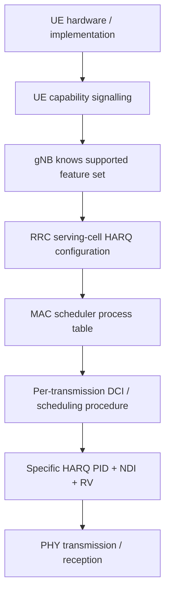

## 1. Capability, configuration and per-transmission control are three different layers

The cleanest way to reason about HARQ process count is:

```text
UE capability
    -> what the UE can support

RRC configuration
    -> how many processes the serving cell actually uses

DCI / scheduling procedure
    -> which process this specific transmission belongs to
```

These are not interchangeable.

## 2. The UE does not always send a simple "I support N HARQ processes" number

Some HARQ behavior is part of the NR baseline, while optional enhancements are capability-signalled.

In newer releases, capability signalling can indicate support for extended HARQ process counts under specific radio conditions/configurations. For example, Rel-17 introduced capability fields related to support for **32 DL and/or UL HARQ processes per SCS** in applicable FR2-2 operation.

So the useful mental model is:

```text
baseline capability mandated by the spec
+
optional capability fields for enhanced operation
```

rather than assuming every UE attaches and sends one generic integer such as `maxHARQ=16`.

## 3. UE capability transfer happens through RRC capability signalling

When the network needs detailed UE radio capabilities, it can use the RRC capability-transfer procedure:

```text
gNB -> UECapabilityEnquiry -> UE
UE  -> UECapabilityInformation -> gNB
```

The returned capability containers include many features beyond HARQ, such as supported bands, band combinations, MIMO, modulation and processing features.

Optional higher-HARQ-process-count support is part of this broader capability framework.

## 4. The number actually used is configured separately

A UE may support more processes than the network chooses to use.

Conceptually:

```text
UE capability: supports up to X under this configuration

RRC serving-cell configuration: use Y

where Y <= supported capability
```

For DL, `nrofHARQ-ProcessesForPDSCH` is the well-known RRC configuration that controls the number of PDSCH HARQ processes in the applicable configuration.

For UL, newer releases also define corresponding PUSCH HARQ-process-count configuration in applicable contexts.

The exact values/defaults depend on release and configuration, so standards work should always check the version of TS 38.331/38.214 being implemented rather than memorize one universal number.

## 5. DL and UL have independent HARQ process spaces

Do not imagine one shared PID table for both directions.

```text
DL HARQ PID 5
  = gNB transmitter / UE receiver transaction context

UL HARQ PID 5
  = UE transmitter / gNB receiver transaction context
```

They can both have number 5 while referring to completely different TBs and buffers.

## 6. Why multiple processes are needed: a pipeline calculation

Assume, as a teaching example:

- slot duration = 1 ms;
- a HARQ transaction cannot be safely reused for 8 ms because feedback/scheduling is still pending.

Then a continuous pipeline could occupy:

```text
slot 0 -> PID 0
slot 1 -> PID 1
slot 2 -> PID 2
...
slot 7 -> PID 7
```

By slot 8, PID 0 ideally needs to have completed or another process is required.

A rough pipeline intuition is:

\\[
N_{HARQ} \gtrsim \frac{T_{reuse}}{T_{opportunity}},
\\]

where \\(T_{reuse}\\) is the effective time before a process can be reused and \\(T_{opportunity}\\) is the spacing between new transmissions that need independent stop-and-wait contexts.

This is not a 3GPP sizing equation; it is an engineering way to understand why longer RTT requires deeper pipelining.

## 7. The scheduler owns process utilization

Suppose 16 DL processes are configured:

```text
PID 0 ... PID 15
```

The scheduler tracks which are:

- available for new data;
- waiting for HARQ feedback;
- awaiting retransmission; or
- otherwise unavailable according to the HARQ procedure.

A simplified table might be:

| PID | State | TB |
|---:|---|---|
| 0 | waiting ACK | A |
| 1 | free | - |
| 2 | waiting ACK | B |
| 5 | retransmission pending | C |
| 7 | free | - |

The scheduler can continue filling free processes without overwriting PID 5's outstanding TB.

## 8. How DCI process-number field size follows the addressable range

If 16 processes are addressable, a binary field needs four bits:

\\[
\log_2(16)=4.
\\]

If 32 are addressable:

\\[
\log_2(32)=5.
\\]

The actual DCI field sizing is standardized per DCI format and applicable configuration; the arithmetic simply explains why increasing the process space can require additional control-information bits.

## 9. NTN makes HARQ pipeline depth much more visible

Terrestrial NR has comparatively short propagation delay. NTN—especially satellite paths—can have much longer round-trip timing.

Suppose, purely as an illustrative pipeline example:

```text
slot duration               = 1 ms
process remains outstanding = 20 ms
```

With only eight independent stop-and-wait processes:

```text
slot 0 -> PID 0
...
slot 7 -> PID 7
slot 8 -> all may still be outstanding
```

The transmitter can become process-limited even if the air interface has unused transmission opportunities.

This is why HARQ process count, HARQ RTT and NTN scheduling are tightly related.

## 10. More processes are not the only NTN solution

Simply increasing the number of processes indefinitely has costs:

- more TX HARQ buffer memory;
- more RX soft-buffer memory;
- more scheduler state;
- potentially larger control fields; and
- more outstanding data/state to manage.

NR NTN therefore also introduces mechanisms where HARQ feedback can be disabled for configured DL HARQ processes/scenarios. The architecture can trade fast HARQ feedback against other reliability mechanisms when propagation timing makes ordinary terrestrial HARQ inefficient.

This is especially important in NTN/HAPS-related Release-17 work.

## 11. Why RX soft-buffer memory scales with HARQ concurrency

Each simultaneously outstanding receiving HARQ process may need soft information for one or more LDPC code blocks.

A rough memory thought experiment:

```text
16 processes x large TB soft buffers
```

can already consume substantial memory. Doubling the process count can materially increase worst-case soft-buffer requirements unless implementation techniques such as buffer sharing, compression or capability limits reduce the footprint.

This is one reason HARQ capability is a hardware/implementation constraint, not merely a scheduler integer.

## 12. Dynamic scheduling and configured-grant nuance

For dynamic scheduling, DCI indicates the HARQ process number for the scheduled PDSCH/PUSCH according to the relevant format.

Configured-grant/configured-scheduling procedures can derive HARQ process identity from configured timing and process rules instead. Therefore:

> "PID is in DCI" is correct for the normal dynamic-scheduling case, but it should not be stated as an exception-free rule for every NR transmission mode.

## 13. Practical end-to-end hierarchy



This hierarchy prevents three common mistakes:

1. confusing support with active configuration;
2. confusing active process count with the PID of one transmission; and
3. assuming NTN must solve long RTT only by adding more processes.

## 14. Standards trail

Primary references:

- **3GPP TS 38.306** — UE radio access capabilities, including release-specific HARQ enhancements.
- **3GPP TS 38.331** — RRC configuration including HARQ-process-count and NTN-related configuration fields.
- **3GPP TS 38.214** — physical-layer HARQ procedures for PDSCH/PUSCH.
- **3GPP TS 38.321** — MAC HARQ entities/processes and configured-grant HARQ behavior.

Useful ETSI specification families:

- <https://www.etsi.org/deliver/etsi_ts/138300_138399/138306/>
- <https://www.etsi.org/deliver/etsi_ts/138300_138399/138331/>
- <https://www.etsi.org/deliver/etsi_ts/138200_138299/138214/>
- <https://www.etsi.org/deliver/etsi_ts/138300_138399/138321/>

For NTN-specific reading, cross-check the Release-17/18 clauses in TS 38.331 and TS 38.214 together with TS 38.300's NTN overview rather than relying on terrestrial HARQ timing assumptions.