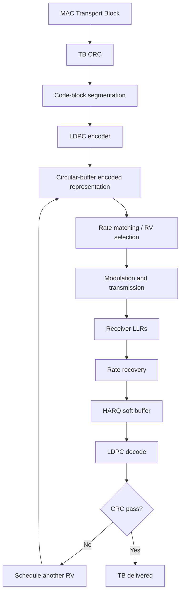

## 1. "Parity bits" can mean three different things

HARQ explanations often say “LDPC adds parity bits” and move on. That hides three distinct mechanisms:

1. **TB CRC bits** — error detection at transport-block level;
2. **code-block CRC bits** — error detection for segmented code blocks when applicable; and
3. **LDPC parity/redundancy bits** — forward-error-correction redundancy used by the decoder.

Only the third category is the main source of the error-correcting redundancy exploited by incremental-redundancy HARQ.

## 2. Start from the transport block

MAC hands PHY a transport block:

```text
Transport Block
      |
      v
TB CRC attachment
      |
      v
code-block segmentation if required
      |
      v
LDPC encoding
```

The TB CRC lets the receiver decide whether the recovered transport block is valid after decoding.

## 3. LDPC systematic and parity structure

Conceptually, an LDPC codeword contains information-related systematic bits and parity/redundancy bits:

```text
+------------------------+---------------------------+
| systematic/data region | LDPC parity/redundancy   |
+------------------------+---------------------------+
```

The complete codeword satisfies the parity-check constraints

\\[
Hc^T=0,
\\]

where \\(H\\) is the sparse LDPC parity-check matrix and \\(c\\) is the encoded codeword.

The parity bits are not a duplicate copy of the payload. They encode additional algebraic constraints that let the iterative decoder infer uncertain information bits.

## 4. Why not transmit the entire mother codeword every time?

The scheduled PDSCH/PUSCH resource allocation determines how many coded bits can actually be carried.

Suppose, purely as an example:

```text
available encoded sequence = 12,000 bits
current allocation carries  =  6,000 bits
```

PHY therefore needs **rate matching** to select the required number of coded bits.

## 5. NR LDPC rate matching uses a circular-buffer model

After LDPC encoding and the standardized bit-ordering/interleaving steps, rate matching selects bits from a circular-buffer representation.

Conceptually:

```text
                   circular buffer

+--------------------------------------------------+
| encoded positions: systematic + parity regions  |
+--------------------------------------------------+
           ^           ^           ^
         RV start    RV start    RV start
```

The actual NR layout includes punctured/null/filler handling and base-graph-dependent equations, so this diagram is deliberately conceptual.

The important principle is:

> **RV changes the starting position used for rate-matching bit selection.**

## 6. The four redundancy versions

NR commonly uses:

```text
RV = 0
RV = 1
RV = 2
RV = 3
```

TS 38.212 defines the base-graph-dependent starting position \\(k_0\\) for the selected RV. The selection then walks the circular buffer, skipping positions that must not be transmitted, until the required output length \\(E\\) is obtained.

Therefore RV is **not** a label such as:

```text
RV0 = all data bits
RV1 = parity set A
RV2 = parity set B
RV3 = parity set C
```

That shortcut is too crude to be technically correct.

## 7. What incremental redundancy really means

Use a simplified encoded sequence:

```text
D0 D1 D2 D3 D4 D5 P0 P1 P2 P3 P4 P5 P6 P7 ...
```

where D represents systematic/data-related positions and P represents parity positions.

A first transmission might expose a subset such as:

```text
RV0 selection:
D0 D1 D2 D3 D4 D5 P0 P1 P2 ...
```

If decoding fails, a later transmission with another RV might expose a partly different subset:

```text
RV2 selection:
D4 D5 P3 P4 P5 P6 P7 ...
```

The receiver can now gain both:

- stronger evidence for overlapping positions; and
- completely new parity/redundancy observations.

That is the essence of **incremental redundancy**.

<div class="technical-callout">
<p><strong>Do not literalize the example:</strong> the exact selected positions depend on base graph, code-block parameters, circular-buffer size, allocated E bits, filler/null positions and the standardized RV start equations.</p>
</div>

## 8. How parity information helps an uncertain data bit

Suppose the direct channel evidence for data bit \\(D_3\\) is almost neutral:

```text
LLR(D3) = +0.05
```

A simplified parity constraint could look like

\\[
D_1 \oplus D_3 \oplus D_7 \oplus P_4 = 0.
\\]

If the decoder has strong beliefs for \\(D_1\\), \\(D_7\\) and \\(P_4\\), that parity equation contributes information about \\(D_3\\).

Real LDPC decoding uses many sparse parity constraints simultaneously. Iterative message passing exchanges information between variable nodes and check nodes until the codeword converges or decoding stops.

```text
variable-node beliefs
       <---->
parity-check constraints
       <---->
updated bit beliefs
```

A retransmission that supplies new parity observations can therefore make previously undecodable systematic bits recoverable.

## 9. Rate recovery maps each received LLR back to the right encoded position

Suppose transmission 1 gives:

```text
encoded position C145 -> LLR +1.2
encoded position C146 -> LLR -0.7
```

and transmission 2 with another RV also contains C145:

```text
C145 -> new LLR +2.0
```

Rate recovery knows that both observations correspond to the same encoded position and can combine them:

\\[
L(C145)=1.2+2.0=3.2
\\]

If transmission 2 contains a previously unseen position C903, the receiver gains its first observation for that parity/redundancy bit.

This is why different RV transmissions can still be combined coherently.

## 10. Chase combining versus incremental redundancy

### Chase combining

The retransmission mostly repeats the same coded information:

```text
TX1: A B C D
TX2: A B C D
```

Benefit: stronger soft evidence for the same positions.

### Incremental redundancy

The retransmission includes at least partly different coded information:

```text
TX1: A B C D
TX2: C D E F
```

Benefit: stronger evidence for C/D **and** new redundancy E/F.

NR's RV/rate-matching framework supports the latter behavior naturally.

## 11. Does the transmitter have to store RV0/RV1/RV2/RV3 bitstreams?

Not architecturally.

At MAC level, the transmitter retains the same TB/MAC PDU in the HARQ process. PHY can regenerate the encoded representation and apply the requested RV on a retransmission.

A real modem implementation may cache encoded/intermediate data to save latency or energy, but that is an implementation optimization rather than a requirement that four complete coded copies be retained.

## 12. Full coding and HARQ chain



## 13. Why HARQ is called "hybrid"

Pure ARQ would merely detect failure and request another transmission.

HARQ combines:

```text
FEC coding
+
soft information from failed reception
+
retransmission
+
optional new redundancy through another RV
```

The retransmission therefore does not discard the work already done by the decoder. It improves the same codeword's evidence.

## 14. Standards trail

Primary references:

- **3GPP TS 38.212** — DL-SCH/UL-SCH transport-block CRC, code-block segmentation, LDPC encoding, LDPC rate matching, circular-buffer bit selection and redundancy-version start positions.
- **3GPP TS 38.214** — physical-layer procedures that use the RV and HARQ control information for PDSCH/PUSCH.

ETSI specification families:

- <https://www.etsi.org/deliver/etsi_ts/138200_138299/138212/>
- <https://www.etsi.org/deliver/etsi_ts/138200_138299/138214/>

The next article moves from one HARQ process to the whole pipeline: **how many processes a UE can support, how many the network actually configures, what DCI can address, and why long NTN delays change the design.**