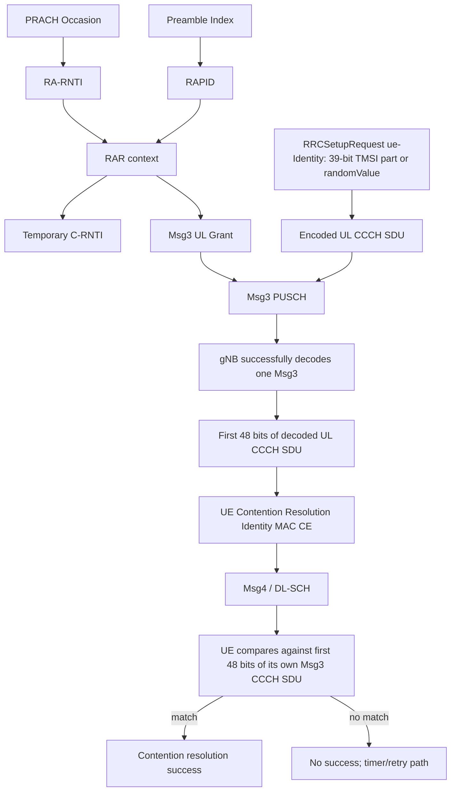

## 1. Why this part of RACH is easy to misunderstand

The four-step contention-based NR Random Access procedure is often summarized as:

```text
Msg1: PRACH
Msg2: Random Access Response (RAR)
Msg3: PUSCH carrying UE signalling
Msg4: Contention Resolution
```

That summary hides the most interesting question:

> If two UEs choose the same PRACH occasion and the same preamble, both can accept the same RAR and both can be assigned the same Temporary C-RNTI. How can Msg4 tell them apart?

The answer is the **UE Contention Resolution Identity MAC CE**. For the initial-access path where Msg3 contains a UL CCCH SDU, the contention-resolution identity is not a new random number generated by the gNB. It is derived directly from what the UE already transmitted in Msg3:

```text
UE creates RRCSetupRequest
        ↓
RRC message is encoded
        ↓
UL CCCH SDU is formed
        ↓
Msg3 carries that CCCH SDU
        ↓
gNB successfully decodes one Msg3
        ↓
gNB copies the first 48 bits of that UL CCCH SDU
        ↓
UE Contention Resolution Identity MAC CE
        ↓
Msg4 carries the identity back to the UE
        ↓
UE compares it with the first 48 bits of its own Msg3 CCCH SDU
```

This article walks through that chain carefully and explains why RA-RNTI, RAPID and Temporary C-RNTI are not enough when a true preamble collision occurs.

<div class="technical-callout">
<p><strong>Scope.</strong> The main path here is contention-based 4-step random access during initial RRC establishment, where the UE has no already-valid C-RNTI for this access and Msg3 contains an UL CCCH SDU such as <code>RRCSetupRequest</code>. 3GPP also defines other random-access cases, including procedures where an existing C-RNTI changes the contention-resolution logic.</p>
</div>

## 2. Start from the identity problem, not from Msg4

Before looking at the 48-bit identity, separate the identities that already exist earlier in RACH.

```text
PRACH occasion
    ↓
RA-RNTI

PRACH preamble index
    ↓
RAPID in the RAR

RAR accepted
    ↓
Temporary C-RNTI

Msg3 UL CCCH SDU
    ↓
first 48 bits
    ↓
UE Contention Resolution Identity
```

These identifiers solve different problems.

| Identifier | What it distinguishes |
|---|---|
| RA-RNTI | A PRACH occasion / random-access response context |
| RAPID | A detected PRACH preamble within that RAR context |
| Temporary C-RNTI | Temporary radio identity assigned by the RAR |
| UE Contention Resolution Identity | Which Msg3 UL CCCH SDU the gNB successfully decoded |

The last one is required because the first three can all become identical for two colliding UEs.

## 3. The full four-step path before the collision case

A UE first acquires the cell and system information:

```text
SSB
 ↓
MIB
 ↓
SIB1
 ↓
RACH-ConfigCommon and related common configuration
 ↓
UE knows valid PRACH occasions and preambles
```

When an access trigger occurs, the UE selects a PRACH occasion and contention-based preamble.

Suppose:

```text
PRACH occasion: slot 20, frequency occasion 1
preamble index: 37
```

The UE transmits:

```text
slot 20
UE ----------------------------------------> gNB
                  Msg1 / PRACH
                  preamble 37
```

No normal dynamic uplink grant is required before Msg1. The network already advertised the legal PRACH opportunities through system information.

Both the UE and gNB can derive the RA-RNTI from the PRACH occasion. The RA-RNTI does not identify one UE; it identifies the relevant random-access response context for that PRACH occasion.

## 4. Msg2: why RAPID exists in addition to RA-RNTI

Assume three UEs used the same PRACH occasion but selected different preambles:

```text
UE A → preamble 5
UE B → preamble 17
UE C → preamble 42
```

They share the same RA-RNTI because they used the same PRACH occasion.

The gNB can respond with a RAR MAC PDU containing multiple responses:

```text
RAR MAC PDU

RAPID 5  → TA + UL Grant A + TC-RNTI A
RAPID 17 → TA + UL Grant B + TC-RNTI B
RAPID 42 → TA + UL Grant C + TC-RNTI C
```

Each UE finds the entry whose RAPID corresponds to the preamble index it transmitted.

For UE B:

```text
my PREAMBLE_INDEX = 17
        ↓
RAR contains RAPID 17
        ↓
this entry is mine
```

If the UEs choose **different preambles**, the gNB can usually assign different Msg3 grants and different Temporary C-RNTIs. No true same-preamble contention remains between those responses.

The interesting case begins when two UEs choose the **same** preamble.

## 5. The true collision case: same RO + same preamble

Assume:

```text
UE A:
    PRACH occasion = X
    preamble = 37

UE B:
    PRACH occasion = X
    preamble = 37
```

Then both have:

```text
same PRACH occasion
    ↓
same RA-RNTI

same preamble
    ↓
same RAPID
```

At the receiver, depending on timing, power and implementation, the gNB may observe the transmission as one detected preamble event rather than as two separately identifiable UEs.

The gNB sends a RAR corresponding to RAPID 37:

```text
RAPID = 37
Timing Advance = TA
Msg3 UL Grant = G
Temporary C-RNTI = 0x1234
```

Both UEs perform the same checks:

```text
Did I transmit preamble 37? YES
Does the RAR contain RAPID 37? YES
```

Therefore both accept the **same RAR**.

Now they also share:

```text
same Msg3 grant G
same Temporary C-RNTI 0x1234
```

This is why Temporary C-RNTI cannot yet prove which UE actually won.

## 6. Why RA-RNTI, RAPID and TC-RNTI all fail to resolve this collision

For the two colliding UEs:

```text
                           UE A            UE B
-------------------------------------------------------
PRACH occasion              X               X
RA-RNTI                     R               R
Preamble index             37              37
RAPID                      37              37
RAR accepted              yes             yes
Msg3 UL grant               G               G
Temporary C-RNTI        0x1234          0x1234
```

Nothing in that list distinguishes UE A from UE B.

Therefore the procedure needs information that originates **inside each UE's own Msg3 content**.

That is where the UL CCCH SDU enters the picture.

## 7. What Msg3 carries during initial RRC establishment

Msg3 is not another PRACH signal. It is a scheduled **PUSCH** transmission using the UL grant delivered in Msg2/RAR.

For initial RRC establishment, Msg3 commonly carries an `RRCSetupRequest` on the CCCH path.

Conceptually:

```text
RRC
    creates RRCSetupRequest
        ↓
SRB0 / CCCH path
        ↓
encoded UL CCCH SDU
        ↓
MAC includes the CCCH SDU in Msg3
        ↓
PUSCH carries Msg3
```

SRB0 is the signalling-radio-bearer context used for CCCH messages before the normal dedicated signalling bearers are established. The important point for contention resolution is that MAC has access to the **UL CCCH SDU bit sequence** placed into Msg3.

## 8. Where the UE identity inside `RRCSetupRequest` comes from

The `RRCSetupRequest` contains an `ue-Identity` choice used during initial establishment. In NR, the relevant alternatives are conceptually:

```text
InitialUE-Identity
├── ng-5G-S-TMSI-Part1   (39 bits)
└── randomValue          (39 bits)
```

### Case A: a 5G-S-TMSI is available

If upper layers provide a 5G-S-TMSI suitable for this procedure, RRC uses `ng-5G-S-TMSI-Part1`, corresponding to the specified 39-bit part of that temporary 5G identity.

Conceptually:

```text
5G-S-TMSI available
        ↓
RRC derives configured 39-bit part
        ↓
RRCSetupRequest.ue-Identity = ng-5G-S-TMSI-Part1
```

### Case B: no suitable 5G-S-TMSI is available

The UE generates a 39-bit random value:

```text
no suitable 5G-S-TMSI
        ↓
generate 39-bit randomValue
        ↓
RRCSetupRequest.ue-Identity = randomValue
```

The purpose of this RRC identity is not to replace all later NAS/core-network identities. In this context it gives the access procedure enough distinguishing information to carry the initial request and support contention resolution.

## 9. A crucial subtlety: 39-bit RRC identity ≠ 48-bit MAC contention identity

It is tempting to say:

```text
RRC randomValue = 39 bits
therefore Msg4 contention identity = that 39-bit value padded to 48 bits
```

That is **not** the rule.

The MAC contention-resolution identity is defined from the **UL CCCH SDU**, not directly from the `ue-Identity` field inside the RRC message.

Conceptually the encoded CCCH message contains more than the 39-bit UE identity:

```text
encoded RRCSetupRequest / UL CCCH SDU

+-----------------------------------------------------------+
| message-choice / ASN.1 encoding bits                      |
| ue-Identity choice + 39-bit value                         |
| establishmentCause                                       |
| spare / other encoded structure as specified             |
+-----------------------------------------------------------+
```

The lower MAC layer does not need to parse the RRC ASN.1 semantics to discover which part is the 39-bit identity.

Instead, for this contention-resolution path, MAC uses a much simpler contract:

> Take the **first 48 bits of the UL CCCH SDU**.

That is the value later compared against the UE Contention Resolution Identity MAC CE.

This cleanly separates layers:

```text
RRC understands:
    5G-S-TMSI part
    randomValue
    establishmentCause
    ASN.1 message semantics

MAC understands:
    I transmitted this UL CCCH SDU in Msg3
    keep its first 48 bits for contention resolution
```

MAC does not need to understand the semantic meaning of the 39-bit RRC identity.

## 10. A bit-level example

Assume UE A's encoded UL CCCH SDU begins with the following illustrative bits:

```text
UE A UL CCCH SDU

10110010 01101101 10101000 11001110 01010110 11100101  ...
|-----------------------------------------------------|
                     first 48 bits
```

UE A stores/retains those first 48 bits for the contention-resolution comparison.

Now assume UE B's independently constructed RRCSetupRequest produces a different encoded UL CCCH SDU:

```text
UE B UL CCCH SDU

00101101 11001000 01110101 00110001 10101001 00011010  ...
|-----------------------------------------------------|
                     first 48 bits
```

The important property is:

```text
UE A first 48 bits ≠ UE B first 48 bits
```

The example bit strings are illustrative; a real implementation uses the standardized RRC encoding and actual CCCH SDU.

## 11. Both UEs now transmit Msg3 on the same PUSCH grant

Because the same RAR was accepted by both UEs:

```text
same UL grant G
same Temporary C-RNTI
```

both prepare Msg3 for the same scheduled uplink resource.

```text
UE A Msg3 ─────┐
               ├──── same PUSCH allocation ────> gNB
UE B Msg3 ─────┘
```

Their Msg3 payloads are not identical because their UL CCCH SDUs differ.

At PHY level, several outcomes are possible.

### Outcome 1: neither Msg3 is decoded

The collision is destructive enough that the gNB obtains no valid Msg3 transport block.

```text
UE A + UE B
     ↓
PUSCH collision
     ↓
no Msg3 decoded
     ↓
no successful contention resolution for either UE
     ↓
contention-resolution procedure eventually fails / timer expires
     ↓
UEs retry random access according to procedure state
```

### Outcome 2: one Msg3 is decoded

Because of received-power difference, channel realization, receiver processing or other physical effects, the gNB may successfully decode one UE's Msg3 while the other is lost.

Suppose UE A wins:

```text
gNB decodes UE A Msg3
        ↓
recovers UE A UL CCCH SDU
        ↓
has UE A's first 48 CCCH bits
```

This is the case in which Msg4 can resolve the contention.

## 12. What the gNB puts in the UE Contention Resolution Identity MAC CE

For the initial-access case under discussion, after successfully receiving the Msg3 UL CCCH SDU, the gNB constructs the **UE Contention Resolution Identity MAC CE**.

Its content is:

```text
first 48 bits of the successfully received UL CCCH SDU
```

Using the earlier example:

```text
Decoded UE A UL CCCH SDU begins:

10110010 01101101 10101000 11001110 01010110 11100101 ...

Therefore:

UE Contention Resolution Identity MAC CE =
10110010 01101101 10101000 11001110 01010110 11100101
```

No new random contention value has been invented by the gNB.

The gNB is effectively saying:

> "The Msg3 I successfully decoded began with these 48 CCCH bits."

## 13. What people commonly call Msg4

"Msg4" is a procedure-level label. There is no physical channel literally named `MSG4`.

At radio level the response uses the normal downlink control/data machinery:

```text
PDCCH
    ↓
schedules PDSCH
    ↓
DL-SCH / MAC PDU
    ↓
UE Contention Resolution Identity MAC CE
    + other signalling as applicable
```

For the initial-access path with a Temporary C-RNTI, the UE monitors the relevant PDCCH as specified by the random-access procedure. A successfully received downlink containing the contention-resolution information allows the UE to decide whether the network decoded **its** Msg3.

The downlink may also carry the next RRC signalling step, for example `RRCSetup`, according to the network procedure. The MAC contention-resolution identity and the RRC message solve different problems: the MAC CE resolves the collision; the RRC message advances connection establishment.

## 14. UE A receives Msg4 and compares the 48 bits

UE A knows what it transmitted in Msg3.

It retained:

```text
first48(UE_A_UL_CCCH_SDU)
```

It receives:

```text
UE Contention Resolution Identity MAC CE
```

Then it compares:

```text
received contention identity
        ==
first 48 bits of my transmitted Msg3 UL CCCH SDU ?
```

For UE A:

```text
received:
10110010 01101101 10101000 11001110 01010110 11100101

stored from Msg3:
10110010 01101101 10101000 11001110 01010110 11100101

MATCH
```

Therefore contention resolution succeeds for UE A.

## 15. UE B may receive the same Msg4 — but it loses

UE B also accepted the original RAR and therefore may be monitoring the same temporary radio context.

It can receive the same Msg4 downlink.

But UE B compares against **its own** original Msg3 CCCH bits:

```text
received from Msg4:
10110010 01101101 10101000 11001110 01010110 11100101

UE B stored from Msg3:
00101101 11001000 01110101 00110001 10101001 00011010
```

They do not match.

```text
NO MATCH
```

So UE B cannot claim that contention resolution succeeded for its Msg3.

If no later valid contention-resolution condition occurs for UE B before the applicable procedure/timer expires, UE B treats the random-access attempt as unsuccessful and returns to retry behavior.

## 16. Why this works even though both UEs had the same TC-RNTI

The identity chain for the same-preamble collision is:

```text
same RACH occasion
        ↓
same RA-RNTI

same preamble
        ↓
same RAPID

same RAR
        ↓
same Temporary C-RNTI
same Msg3 UL grant

BUT

different RRCSetupRequest / UL CCCH SDU
        ↓
different first 48 bits
        ↓
Msg4 can identify which Msg3 the gNB decoded
```

That is the central design insight.

TC-RNTI is necessary to continue temporary scheduling, but in this collision case it is not sufficient by itself to prove which UE won. The Msg3 content supplies the missing discriminator.

## 17. What happens to Temporary C-RNTI after successful contention resolution?

For this initial-access path, when the contention-resolution identity matches and the procedure succeeds, the Temporary C-RNTI is promoted/used as the UE's C-RNTI according to the MAC random-access procedure.

Conceptually:

```text
Msg2 / RAR:
    TEMPORARY_C-RNTI = 0x1234

Msg3:
    UE uses temporary RACH context

Msg4:
    contention identity matches

SUCCESS:
    C-RNTI = 0x1234
```

The numeric value can remain the same; what changes is the procedure state and meaning. The UE now has a successfully established radio identity for subsequent dedicated scheduling.

## 18. A complete numerical-style collision example

Consider the following simplified timeline.

### Step 1 — both UEs select the same PRACH resource

```text
PRACH occasion:
    slot 20
    frequency occasion 1

UE A preamble = 37
UE B preamble = 37
```

Because the RO is the same:

```text
RA-RNTI_A = RA-RNTI_B = R
```

### Step 2 — gNB sends one RAR for preamble 37

```text
RAR entry:
    RAPID = 37
    TA = 22
    Msg3 UL grant = G
    TC-RNTI = 0x1234
```

Both UEs accept it.

### Step 3 — each UE builds a different `RRCSetupRequest`

UE A has no suitable 5G-S-TMSI, so it generates an illustrative random 39-bit value:

```text
UE A randomValue = A39
```

UE B independently generates:

```text
UE B randomValue = B39
```

Their encoded UL CCCH SDUs therefore differ.

Illustrative prefixes:

```text
UE A first 48 CCCH bits:
10110010 01101101 10101000 11001110 01010110 11100101

UE B first 48 CCCH bits:
00101101 11001000 01110101 00110001 10101001 00011010
```

### Step 4 — both transmit Msg3 using grant G

```text
slot K, same PUSCH allocation

UE A Msg3 ───┐
              ├────> gNB
UE B Msg3 ───┘
```

Suppose the gNB successfully decodes UE A.

### Step 5 — gNB creates the contention-resolution MAC CE

```text
Contention Resolution Identity =
first48(decoded UE A UL CCCH SDU)
```

Therefore:

```text
10110010 01101101 10101000 11001110 01010110 11100101
```

### Step 6 — both UEs receive the downlink contention-resolution message

UE A:

```text
received first48 == my transmitted first48
YES
→ contention resolution success
→ TC-RNTI 0x1234 becomes established C-RNTI context
```

UE B:

```text
received first48 == my transmitted first48
NO
→ this contention-resolution identity is not mine
→ UE B eventually retries if no success condition occurs
```

This is the complete reason Msg4 can separate two UEs that were indistinguishable at the PRACH/RAR stage.

## 19. Same RACH occasion but different preambles: why Msg4 collision is usually avoided earlier

Now change only one thing:

```text
UE A: RO X, preamble 17
UE B: RO X, preamble 36
```

They still have the same RA-RNTI because the RACH occasion is the same.

But the gNB can distinguish the detected preambles and build separate RAR entries:

```text
RAPID 17
    UL grant G1
    TC-RNTI A

RAPID 36
    UL grant G2
    TC-RNTI B
```

Now:

```text
UE A Msg3 → resource G1
UE B Msg3 → resource G2
```

The severe same-resource Msg3 collision is avoided.

So the dangerous contention case is not merely:

```text
same PRACH occasion
```

It is:

```text
same PRACH occasion
+
same preamble
```

## 20. What if the gNB decodes neither Msg3?

Then there is no successfully recovered UL CCCH SDU from which to construct a valid contention-resolution identity for either UE.

Conceptually:

```text
Msg3 collision
    ↓
no valid transport block decoded
    ↓
no valid CCCH SDU
    ↓
no successful contention-resolution response for these UEs
    ↓
UE contention-resolution timer/procedure expires
    ↓
random access failure/retry logic
```

On retry, the UE can again select from the configured contention-based random-access resources according to the MAC procedure. Other RA state—such as attempt counters, power-ramping state and backoff behavior—also participates in the complete retry procedure.

## 21. What if the two UEs somehow produce the same first 48 bits?

The contention-resolution mechanism relies on the 48-bit CCCH prefix as specified by MAC. It is not a cryptographic identity mechanism and is not intended to provide globally unique authentication.

For ordinary initial-access operation, independently formed `RRCSetupRequest` messages—especially when they contain different temporary-identity parts or different random values—normally yield different contention-resolution prefixes.

The protocol purpose is narrower:

> determine whether the Msg3 CCCH SDU successfully decoded by the gNB corresponds to the Msg3 that this UE transmitted.

Subscriber authentication and permanent identity security belong to later NAS/security procedures, not to this 48-bit MAC contention-resolution check.

## 22. This is a cross-layer mechanism

One reason this procedure is technically interesting is that three layers participate without violating their abstraction boundaries.

### RRC

RRC creates the semantic connection-establishment request:

```text
RRCSetupRequest
    ue-Identity
    establishmentCause
    ...
```

### RLC / CCCH transport path

The initial RRC message is carried through the common-control signalling path toward MAC.

### MAC

MAC does not need to understand the ASN.1 identity semantics. It only needs the actual CCCH SDU bytes/bits that it transmitted in Msg3.

For contention resolution:

```text
MAC stores first48(UL CCCH SDU)
```

At the gNB:

```text
MAC receives decoded UL CCCH SDU
        ↓
forms UE Contention Resolution Identity MAC CE from first 48 bits
```

At the UE:

```text
received MAC CE
        ↓
compare with stored first48(Msg3 CCCH SDU)
```

This is an efficient cross-layer contract: RRC supplies distinguishable message content; MAC resolves contention using the encoded message without having to parse RRC semantics.

## 23. Do not confuse this with subscriber authentication

The contention-resolution identity answers:

```text
"Did the gNB decode the Msg3 that I transmitted?"
```

It does **not** answer:

```text
"Has the network cryptographically authenticated this subscriber?"
```

Those are completely different stages.

After radio access and RRC establishment progress, NAS registration, authentication, security-mode procedures and other control-plane mechanisms establish the subscriber/network security context.

Therefore:

```text
RACH contention identity
    = radio collision-resolution mechanism

5G AKA / NAS authentication
    = subscriber/network authentication and security mechanism
```

## 24. Existing-C-RNTI random access is a different branch

The 48-bit UL-CCCH comparison described here is especially relevant when the UE does not already have a valid C-RNTI and Msg3 contains a CCCH SDU for initial access.

Other random-access triggers can occur when a UE already has a valid C-RNTI. In those branches, 3GPP MAC contention resolution can use C-RNTI-based control-channel behavior rather than the same initial-access CCCH-identity path.

That is why the safest interview wording is:

> "For initial contention-based access where Msg3 contains a UL CCCH SDU, Msg4 contention resolution uses the UE Contention Resolution Identity MAC CE derived from the first 48 bits of that Msg3 CCCH SDU. Other RACH scenarios with an existing C-RNTI have different contention-resolution conditions."

## 25. Mapping this into a protocol-level C++ RACH simulator

A protocol simulator should preserve the identity chain rather than invent a random Msg4 identity.

A useful model is:

```text
UE creates Msg3
    ↓
Msg3 contains CCCH SDU
    ↓
UE stores first48(CCCH SDU)
    ↓
Channel transports Msg3 event
    ↓
gNB selects/decodes one Msg3
    ↓
gNB creates Msg4 identity = first48(decoded CCCH SDU)
    ↓
UE compares received identity with stored first48
```

Conceptual data structures could evolve toward:

```cpp
struct Msg3Payload {
    // protocol-level abstraction of the UL CCCH SDU
    std::vector<std::uint8_t> ccch_sdu;
};

struct Msg4Payload {
    std::array<std::uint8_t, 6> contention_resolution_identity;
};
```

The important invariant is not the exact container type. It is the relationship:

```text
Msg4.contention_resolution_identity
    = first 6 octets / first 48 bits of successfully decoded Msg3 CCCH SDU
```

The simulator should **not** do this:

```text
Msg4 identity = new random number
```

because that would lose the actual NR contention-resolution semantics.

### Companion repository — explicitly incomplete

The C++ protocol-level RACH simulator being developed alongside these notes is public at:

**[pppiyushh/RACH_sim](https://github.com/pppiyushh/RACH_sim)**

<div class="technical-callout">
<p><strong>Status: incomplete / work in progress.</strong> The repository is an educational C++ protocol-level simulator under active development. It is not a full NR stack, not a PHY waveform implementation and not a 3GPP conformance reference. Current work focuses on the UE/Cell/Channel architecture, slot-synchronized event scheduling and incremental implementation of initial-access/RACH behavior. Msg1–Msg4, timers, collision semantics and identity handling are being built step by step.</p>
</div>

Publishing the incomplete state makes the engineering decisions, mistakes and refinements visible instead of presenting a finished result without its design history.

## 26. Suggested simulator collision test

Once Msg3/Msg4 exist, a useful deterministic unit/integration scenario is:

```text
UE A and UE B:
    same PRACH occasion
    same preamble 37

RAR:
    RAPID 37
    same Msg3 grant
    TC-RNTI = 0x1234

UE A Msg3:
    CCCH prefix = A48

UE B Msg3:
    CCCH prefix = B48
```

Configure the simulated gNB receiver to select UE A as the successfully decoded Msg3.

Expected behavior:

```text
gNB Msg4 identity = A48

UE A:
    received A48 == stored A48
    → success

UE B:
    received A48 != stored B48
    → no contention success
    → timer eventually expires / retry
```

Then add a second test where neither Msg3 is decoded:

```text
no Msg4 success identity
→ both UEs fail contention resolution
```

And a third test with different preambles:

```text
same RO
preamble 17 vs 36
→ separate RAPIDs / RAR entries / Msg3 grants
→ no same-grant Msg3 collision
```

Those three scenarios exercise the reason the identity chain exists.

## 27. The complete identity chain in one diagram



## 28. Interview-ready answer

A concise but strong answer is:

> "In contention-based initial access, two UEs can choose the same PRACH occasion and the same preamble. They then derive the same RA-RNTI, match the same RAPID, accept the same RAR, receive the same Msg3 grant and may even use the same Temporary C-RNTI. To resolve that ambiguity, Msg3 carries an UL CCCH SDU such as an RRCSetupRequest. The UE retains the first 48 bits of that CCCH SDU. If the gNB successfully decodes one Msg3, it puts the first 48 bits of that decoded CCCH SDU into the UE Contention Resolution Identity MAC CE in the downlink contention-resolution message. Each UE compares that value with the first 48 bits of its own transmitted Msg3 CCCH SDU. The matching UE succeeds; the other UE does not and eventually retries. The 48-bit value is therefore not simply the 39-bit RRC random identity padded to 48 bits—it is the first 48 bits of the encoded UL CCCH SDU."

The progression worth memorizing is:

```text
RA-RNTI
    identifies the PRACH occasion

RAPID
    identifies the preamble response

TC-RNTI
    provides temporary scheduling identity

first48(Msg3 UL CCCH SDU)
    resolves a same-preamble contention
```

## 29. Standards trail

Primary references:

- **3GPP TS 38.300** — overall NR architecture and random-access procedure context.
- **3GPP TS 38.331** — `RRCSetupRequest`, `InitialUE-Identity`, `ng-5G-S-TMSI-Part1`, `randomValue`, establishment-cause signalling and RRC system-information/configuration structures.
- **3GPP TS 38.321** — MAC Random Access procedure, Temporary C-RNTI behavior, contention-resolution procedure and the **UE Contention Resolution Identity MAC CE**.

Useful ETSI publications:

- TS 38.331 Release 18: <https://www.etsi.org/deliver/etsi_ts/138300_138399/138331/18.08.00_60/ts_138331v180800p.pdf>
- TS 38.321 Release 18: <https://www.etsi.org/deliver/etsi_ts/138300_138399/138321/18.04.00_60/ts_138321v180400p.pdf>

The main lesson is that contention resolution is not a separate arbitrary identifier exchange. It reuses the actual Msg3 CCCH content as evidence of which UE's uplink request the gNB successfully decoded.