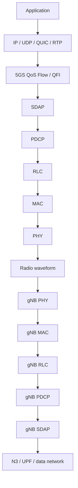

## 1. Start with two applications, not with protocol acronyms

Assume a UE is simultaneously:

- sending a live video call; and
- loading a web page.

The applications do not directly call `SDAP(video)` or choose `RLC-UM`. They create ordinary transport/network packets. A possible uplink path is:

```text
Video encoder -> RTP/UDP/IP -> IP packet V
Browser       -> QUIC/UDP/IP -> IP packet B
```

The 5GS QoS framework classifies packets according to the PDU-session QoS rules. For this worked example only, assume:

```text
video packet   -> QoS Flow QFI 5
browser packet -> QoS Flow QFI 9

QFI 5 -> DRB 2 -> RLC UM -> logical channel LCID 5
QFI 9 -> DRB 1 -> RLC AM -> logical channel LCID 4
```

Those QFI values and bearer choices are illustrative. A commercial OTT video call may simply use a default non-GBR QoS flow unless the operator/service architecture provides differentiated QoS.

<div class="technical-callout">
<p><strong>Important boundary:</strong> SDAP does not inspect an application and decide that it is “video.” The QoS-flow classification is part of the 5GS QoS/NAS/PDU-session machinery. SDAP adapts the already identified QoS flow to the radio-bearer world.</p>
</div>

## 2. The complete user-plane chain



The layers solve different problems:

| Layer | Main engineering question |
|---|---|
| SDAP | Which DRB carries this QoS flow? |
| PDCP | How is this bearer securely numbered, reordered, compressed and duplicated? |
| RLC | How do upper-layer packets fit changing MAC transmission opportunities, and is ARQ required? |
| MAC | Which logical-channel data goes into the next transport block, and which HARQ process carries it? |
| PHY | How are the transport-block bits coded, modulated, mapped to resources and transmitted as a waveform? |

## 3. SDAP: from QoS Flow to DRB

5GC reasons in **QoS Flows**, identified by QFI. The radio stack underneath reasons in **Data Radio Bearers**.

For our example:

```text
QFI 5 -> SDAP -> DRB 2
QFI 9 -> SDAP -> DRB 1
```

SDAP's principal NR functions include:

- QoS-flow-to-DRB mapping;
- QFI marking when an SDAP header is present;
- default-DRB handling;
- reflective QoS-flow-to-DRB mapping; and
- end-marker handling when a mapping changes.

A single SDAP entity is associated with an individual PDU session.

If an SDAP header is configured, the packet can conceptually look like:

```text
+-------------+----------------------------------+
| SDAP header | IP | UDP | RTP | video payload  |
| QFI = 5     |                                  |
+-------------+----------------------------------+
```

The SDAP PDU becomes a **PDCP SDU**.

## 4. PDCP: bearer security and packet-level state

PDCP operates per radio bearer. Its functions include:

- PDCP sequence numbering and COUNT maintenance;
- ciphering/deciphering;
- integrity protection/verification where configured/applicable;
- header compression such as ROHC;
- reordering and delivery control;
- duplicate detection/discard;
- timer-based discard;
- PDCP duplication; and
- routing for split bearers / multi-connectivity.

Suppose the next video packet on DRB 2 gets:

```text
PDCP SN = 104
```

Conceptually:

```text
+----------------+--------------------------------------+
| PDCP hdr SN104 | SDAP | IP | UDP | RTP | video data  |
+----------------+--------------------------------------+
```

Ciphering is applied according to the PDCP security procedure; the packet passed down is no longer simply a clear IP datagram on the radio interface.

The PDCP PDU becomes an **RLC SDU**.

## 5. RLC: fit arbitrary packets into changing transmission opportunities

RLC has TM, UM and AM modes. For ordinary DRB user traffic, the important contrast is UM versus AM.

### 5.1 UM

UM provides sequence-number-based delivery support and segmentation/reassembly, but **no RLC ARQ**.

This can suit latency-sensitive data where recovering a very old packet may be less valuable than progressing to newer data.

### 5.2 AM

AM adds ARQ through STATUS reporting and retransmission. It also supports re-segmentation of data that must be retransmitted.

### 5.3 Segmentation example

Suppose PDCP hands RLC a 1,200-byte PDU but MAC currently offers room for only about 400 bytes of RLC data:

```text
PDCP PDU: 1200 B
       |
       +--> RLC PDU / segment A
       +--> RLC PDU / segment B
       +--> RLC PDU / segment C
```

The exact segmentation follows the actual transmission opportunities that MAC exposes. TS 38.322 explicitly defines the lower-layer service as notification of a transmission opportunity **together with its total size**.

The RLC PDU becomes a **MAC SDU**.

## 6. MAC: multiplex traffic into one radio transmission

MAC sees logical channels, not applications.

For our example:

```text
LCID 5 queue: video RLC data
LCID 4 queue: browser RLC data
```

MAC functions include:

- logical-channel to transport-channel mapping;
- multiplexing/demultiplexing;
- Scheduling Request and Buffer Status Report procedures;
- Logical Channel Prioritization (LCP);
- HARQ;
- MAC Control Elements; and
- padding.

Suppose the UE has:

```text
video queue   = 380 B
browser queue = 900 B
```

but the current grant yields a MAC payload opportunity of only 500 B. LCP determines how much eligible data from each logical channel is included, according to its configured prioritization state.

A simplified MAC PDU could be:

```text
+----------------------+--------------------+
| MAC subhdr: LCID 5   | video RLC PDU      |
+----------------------+--------------------+
| MAC subhdr: LCID 4   | browser RLC data   |
+----------------------+--------------------+
| MAC CE / padding as applicable            |
+-------------------------------------------+
```

The crucial architectural change is that **multiple radio bearers can now be multiplexed into one MAC PDU / transport block**.

## 7. Logical, transport and physical channels are different abstractions

For uplink user traffic, a typical conceptual chain is:

```text
DTCH -> UL-SCH -> PUSCH
```

where:

- DTCH is a **logical channel**: what kind of information is being carried;
- UL-SCH is a **transport channel**: the PHY/MAC transport abstraction; and
- PUSCH is the **physical channel** carrying the scheduled uplink transmission.

Do not use DTCH, UL-SCH and PUSCH as synonyms.

## 8. PHY: turn the transport block into a waveform

For a PUSCH/PDSCH data transport block, the PHY processing chain includes, at a high level:

```text
Transport Block
   -> TB CRC
   -> code-block segmentation if required
   -> LDPC channel coding
   -> rate matching / RV selection
   -> scrambling
   -> modulation
   -> layer mapping
   -> precoding
   -> resource-element mapping
   -> OFDM waveform generation
   -> RF chain / antenna
```

PHY no longer needs to know whether a particular bit originated from a browser or video codec. QoS semantics have already been translated into bearer, scheduling and resource-allocation decisions above it.

## 9. Across the air and up the gNB stack

The gNB performs the inverse chain.

PHY approximately performs:

```text
RF reception
 -> synchronization
 -> FFT
 -> channel estimation
 -> MIMO detection/equalization
 -> soft demodulation / LLR generation
 -> rate recovery
 -> LDPC decoding
 -> CRC check
 -> transport block
```

MAC then demultiplexes using LCIDs and forwards each MAC SDU to its RLC entity. RLC reassembles the PDCP PDU, PDCP performs its receiving-side security/reordering/decompression procedures, and SDAP maps the packet back to the corresponding QoS flow toward the 5GC user plane.

## 10. The SDU/PDU naming chain

This is the most useful packet-flow relationship to memorize:

```text
SDAP PDU = PDCP SDU
PDCP PDU = RLC SDU
RLC  PDU = MAC SDU
MAC  PDU -> transport block handling toward PHY
```

"SDU" means the payload presented **to** a layer by the layer above. "PDU" means the protocol unit created **by** that layer.

## 11. Where video and browser traffic actually become different

```text
Video                            Browser
  |                                 |
QoS Flow QFI 5                  QoS Flow QFI 9
  |                                 |
SDAP                              SDAP
  |                                 |
DRB 2                             DRB 1
  |                                 |
PDCP 2                            PDCP 1
  |                                 |
RLC UM                            RLC AM
  |                                 |
LCID 5                            LCID 4
   \                               /
    +--------- MAC / LCP ----------+
                 |
              one TB
                 |
                PHY
```

The distinction is progressively translated:

1. **QoS level:** different QFIs;
2. **radio bearer level:** potentially different DRBs and PDCP/RLC configurations;
3. **MAC level:** different logical-channel priorities competing for finite grant capacity;
4. **PHY level:** coded bits carried according to the scheduler's physical-resource decision.

## 12. What RRC contributes

RRC does not process every video packet. It configures much of the machinery beforehand, including DRBs, PDCP/RLC parameters, logical-channel parameters and extensive MAC/PHY configuration.

Think of RRC as configuration/control and the SDAP-to-PHY path above as the high-rate data plane.

## 13. Standards trail

Primary specifications:

- **3GPP TS 38.300** — NR/NG-RAN overall architecture and Layer-2 data-flow model, especially clauses 6.2-6.6.
- **3GPP TS 37.324** — SDAP.
- **3GPP TS 38.323** — PDCP.
- **3GPP TS 38.322** — RLC.
- **3GPP TS 38.321** — MAC.
- **3GPP TS 38.211-38.215** — NR physical-layer waveform, coding, procedures and measurements.

Useful current ETSI publication of TS 38.300 Release 18: <https://www.etsi.org/deliver/etsi_ts/138300_138399/138300/18.08.00_60/ts_138300v180800p.pdf>

The next article isolates one architectural question hidden inside this packet walk: **why does 5G need both a QFI and a DRB instead of using a single identifier?**