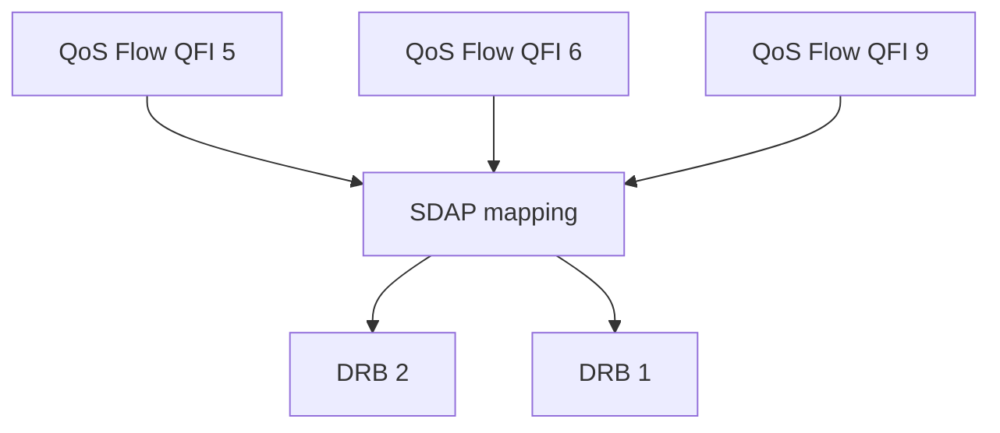

## 1. The one-line distinction

A **QFI** identifies a QoS Flow within a PDU session. A **DRB** is a radio bearer used between UE and gNB.

The most useful mental model is:

```text
QFI = what QoS treatment this traffic belongs to
DRB = how the RAN chooses to carry that traffic over Uu
```

These are intentionally separate abstractions.

## 2. QFI lives in the 5GS QoS world

5GS QoS is defined around **QoS Flows**. Each flow inside a PDU session is identified by a **QoS Flow Identifier (QFI)**.

A flow can be associated with characteristics such as:

- 5QI;
- priority level;
- packet delay budget;
- packet error-rate characteristics;
- GBR/non-GBR behavior where applicable; and
- additional QoS parameters defined by the 5GS architecture.

The important point is that the QoS Flow is a **5G-system service abstraction**, not merely a radio bearer.

## 3. DRB lives in the radio-access world

A Data Radio Bearer is configured on Uu and is associated with concrete lower-layer state:

```text
DRB
  -> PDCP entity/configuration
  -> RLC entity/configuration
  -> logical-channel configuration
  -> MAC prioritization context
  -> physical-resource scheduling consequences
```

For example:

```text
DRB 1 -> PDCP 1 -> RLC AM -> LCID 4
DRB 2 -> PDCP 2 -> RLC UM -> LCID 5
```

The DRB therefore represents a **radio implementation choice**.

## 4. SDAP is the adaptation boundary

SDAP sits between the two abstractions:



A possible mapping is:

```text
QFI 5 -> DRB 2
QFI 6 -> DRB 2
QFI 9 -> DRB 1
```

That mapping is exactly why SDAP exists.

## 5. Why not use one DRB for every QFI?

A one-to-one design would be simple conceptually:

```text
QFI 5 -> DRB 5
QFI 6 -> DRB 6
QFI 7 -> DRB 7
...
```

but would duplicate radio state unnecessarily whenever several QoS flows can accept the same radio treatment.

Every additional DRB can imply additional:

- PDCP state;
- RLC state and buffers;
- sequence-number spaces;
- timers;
- logical-channel configuration; and
- RRC signaling/configuration complexity.

If QFI 5 and QFI 6 can use the same radio bearer behavior, SDAP can map both onto DRB 2 instead.

## 6. Why preserve QFI when a DRB already exists?

Because a DRB does not necessarily identify a single QoS flow.

Suppose DRB 2 carries:

```text
QFI 5
QFI 6
QFI 7
```

Knowing only that a packet arrived on DRB 2 is insufficient to distinguish which QoS flow it belongs to. When configured, the SDAP header can mark the QFI explicitly.

Conceptually:

```text
DRB 2 stream:
[QFI 5][packet]
[QFI 7][packet]
[QFI 5][packet]
[QFI 6][packet]
```

The QFI and DRB therefore contain **different information**.

## 7. Why not eliminate DRBs and use QFI everywhere?

Because several QoS flows may need the same radio implementation, and lower layers need bearer-specific state rather than an end-to-end QoS label.

If lower layers operated directly on every QFI, the RAN would repeatedly need to associate each flow with:

- PDCP configuration;
- RLC AM/UM choice;
- RLC SN length and timers;
- logical channel and LCID;
- logical-channel priority; and
- other bearer behavior.

A DRB lets the RAN aggregate compatible QoS flows into one radio-bearer configuration.

## 8. The architectural decoupling is the real benefit

Suppose initially:

```text
QFI 5 -> DRB 1
```

Later the RAN decides a different bearer is more appropriate:

```text
QFI 5 -> DRB 2
```

The **QoS-flow identity can remain QFI 5** while the radio implementation changes.

That separation gives the RAN freedom to optimize radio behavior without redefining the end-to-end service identity.

## 9. Worked video + browsing example

Assume a PDU session contains:

```text
QFI 5 -> low-latency video flow
QFI 9 -> ordinary web/default flow
```

and SDAP maps:

```text
QFI 5 -> DRB 2
QFI 9 -> DRB 1
```

Radio configuration might then differ:

```text
DRB 2
  -> PDCP 2
  -> RLC UM
  -> LCID 5
  -> higher logical-channel priority

DRB 1
  -> PDCP 1
  -> RLC AM
  -> LCID 4
  -> lower logical-channel priority
```

The application did not directly select those lower-layer parameters. The network translates QoS intent into an appropriate bearer configuration.

## 10. The mapping is not inherently one-to-one

The key relationship to remember is:

```text
many QoS Flows -> one DRB   (allowed when configured)
```

A DRB can therefore be viewed as a **radio transport container** for one or more QoS flows whose packets are compatible with that bearer treatment.

Do not confuse this with split-bearer or PDCP-duplication mechanisms lower in the stack; those solve a different problem.

## 11. Why the separation also matters during mobility

QoS-flow identity belongs to the PDU-session QoS architecture, whereas radio bearers are access-stratum configuration objects. During mobility or reconfiguration, radio bearer details can change while the PDU-session QoS semantics remain logically continuous.

Conceptually:

```text
before mobility: QFI 5 -> DRB 2

after reconfiguration: QFI 5 -> DRB 3
```

The service requirement does not need to become a different QoS flow merely because the RAN changed bearer configuration.

## 12. Interview answer

A compact answer is:

> QFI and DRB are separate because they represent different layers of abstraction. QFI identifies an end-to-end 5GS QoS Flow inside a PDU session, while a DRB is the radio bearer used over Uu. SDAP maps one or more QoS flows onto DRBs, which lets the RAN aggregate compatible flows, remap them, and change PDCP/RLC/logical-channel behavior without changing the QoS-flow identity seen by the 5GS.

## 13. Standards trail

Primary references:

- **3GPP TS 23.501 / TS 23.503** — 5GS architecture and QoS model.
- **3GPP TS 37.324** — SDAP procedures and QFI/DRB mapping.
- **3GPP TS 38.300** — NR Layer-2 architecture and QoS-flow-to-DRB role of SDAP.
- **3GPP TS 38.331** — RRC bearer and SDAP configuration.

The next article moves one layer down and explains the mechanism that is frequently compared incorrectly with CPU threading: **HARQ process state, soft-buffer ownership and LLR combining**.